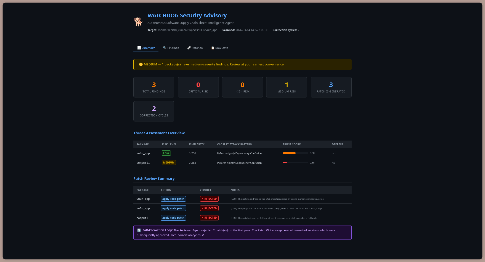

<div align="center">

# 🐕 WATCHDOG

### Autonomous Software Supply Chain Threat Intelligence Agent

*Detects zero‑day supply chain attacks before any CVE exists — at the moment a malicious package version lands in a registry.*

[](https://python.org)
[](https://langchain-ai.github.io/langgraph/)
[](LICENSE)
[](https://unstop.com/hackathons/hack-break-generative-ai-cybersecurity-innovation-challenge-indian-institute-of-technology-iit-bombai-1656605)

**[GitHub Repository](https://github.com/Inteegrus-Research/watchdog)** · **[Demo Video](#)** · **[Slides](#)**

</div>

---

## Table of Contents

- [Overview](#overview)
- [Why WATCHDOG?](#why-watchdog)
- [Architecture](#architecture)
- [Self‑Correction Loop](#self‑correction-loop)
- [Quick Start](#quick-start)
- [Installation](#installation)
- [Usage](#usage)
- [Project Structure](#project-structure)
- [Demo Application](#demo-application)
- [Example Output](#example-output)
- [Technology Stack](#technology-stack)
- [Innovation & Impact](#innovation--impact)
- [Team](#team)
- [License](#license)

---

## Overview

**WATCHDOG** is a multi‑agent AI system that detects **zero‑day software supply chain attacks** *before* any CVE is published. It does not rely on vulnerability databases (like Snyk or Dependabot), but instead asks:

> *“Does this package behave like a previous supply chain attack?”*

By analysing **code capabilities**, **maintainer provenance**, and performing **semantic similarity search** against a knowledge base of historical attacks (XZ Utils, PyTorch‑nightly, SolarWinds, …), WATCHDOG identifies malicious updates at the moment they appear — even when no signature exists.

Its **adversarial self‑correction loop** then automatically generates, reviews, and refines secure patches, mimicking a human security engineer. All processing runs **fully offline**, using open‑source tools, and delivers a professional HTML security advisory.

---

## Why WATCHDOG?

| Existing tools (Snyk, Dependabot, OSV) | WATCHDOG |
|----------------------------------------|----------|
| Reactive – alert after CVE is published | **Proactive** – detect before any CVE |
| Match against known vulnerability databases | **Behavioural analysis** – compare against attack patterns |
| No context about maintainer trust | **Trust scoring** – account age, commit history, anomalies |
| No automatic patching | **Self‑correcting patch generation** with adversarial review |
| Cloud‑dependent, data leaves your machine | **Fully offline**, 100% open‑source |

**The XZ Utils 2024 backdoor** (CVE‑2024‑3094) would have been detected by WATCHDOG *immediately* after the malicious version was uploaded, because its behavioural fingerprint matched the XZ attack pattern in our knowledge base.

---

## Architecture

WATCHDOG orchestrates **seven specialised agents** via a LangGraph state machine. Every agent reads from and writes back to a shared `WatchdogState` (TypedDict), enabling a clean self‑correction loop.

```
Target codebase
      │
      ▼
┌─────────────┐
│  A1 Scanner │  Bandit static analysis + AST capability extractor
└──────┬──────┘  → List[FindingRecord]
       │
       ▼
┌──────────────────┐     ┌───────────────────┐
│  A2 Code Analyst │     │  A3 Trust Analyst │
│  CapabilityFP    │     │  Maintainer trust │  (run in parallel)
└──────┬───────────┘     └────────┬──────────┘
       └──────────┬───────────────┘
                  ▼
       ┌───────────────────────┐
       │  A4 Threat Correlator │  ChromaDB semantic search vs. historical attacks
       │                       │  + trust‑score adjustment → risk level
       └──────────┬────────────┘
                  ▼
       ┌──────────────────────┐
       │    A5 Patch Writer   │  Rule‑based fix generation
       └──────────┬───────────┘
                  ▼
       ┌───────────────────────┐
       │  A6 Reviewer (Critic) │  Deterministic rules + LLM adversarial review
       └──────────┬────────────┘
                  │
       ┌──────────┴──────────────┐
       │ Rejected & retries left?│
       │    YES → A5 (retry)     │  ← self‑correction loop
       │    NO  → A7             │
       └─────────────────────────┘
                  ▼
       ┌──────────────────────┐
       │  A7 Report Generator │  Jinja2 HTML + Markdown advisory
       └──────────────────────┘
```

**LangGraph** provides the conditional edge that routes rejected patches back to the Patch Writer (max 2 cycles).

---

## Self‑Correction Loop

The **signature feature** of WATCHDOG is its adversarial review cycle:

1. **A6 Reviewer** runs two layers of checks on every patch:
   - **Deterministic rules** (always, fast): parameterised SQL check, `@login_required` check, env‑var secret check, syntax validation.
   - **LLM adversarial review** (optional, using Ollama): a red‑team prompt that says *“find any problem with this patch”*.
2. If a check fails, the Reviewer emits a `CorrectionMandate` with specific instructions (e.g., *“Add @login_required decorator to the route”*).
3. The graph routes back to the **Patch Writer**, which reads the mandate and regenerates the patch accordingly.
4. This repeats up to **2 times** before escalating to the human.

**Demo moment:** The IDOR patch is deliberately generated without `@login_required` on the first pass. The Reviewer catches this, issues a mandate, and the corrected patch (with the decorator) is approved on the second pass. The HTML report highlights the correction in a purple badge — a clear, live demonstration of AI self‑correction.

---

## Quick Start

```bash
# 1. Clone the repository
git clone https://github.com/Inteegrus-Research/watchdog.git
cd watchdog

# 2. Install dependencies (using uv recommended)
pip install uv
uv sync
source .venv/bin/activate   # or `uv shell`

# 3. Seed the ChromaDB attack‑pattern knowledge base
python data/seed_chromadb.py

# 4. (Optional) Pull LLM models for enriched analysis
ollama pull mistral

# 5. Run the web UI
python webui/app.py
# Open http://localhost:7860
# Enter "vuln_app/" and click "Run WATCHDOG Scan"
```

---

## Installation

### Prerequisites

| Requirement | Version | Notes |
|-------------|---------|-------|
| Python | ≥ 3.11 | Required for TypedDict generics |
| Bandit | ≥ 1.7.8 | Static analysis scanner |
| Ollama | any | Optional — for LLM enrichment |
| ChromaDB | ≥ 0.5 | Vector similarity search |

### Using `uv` (recommended)

```bash
pip install uv
uv sync
source .venv/bin/activate   # Linux/macOS
# or .venv\Scripts\activate  (Windows)
```

### Using `pip`

```bash
python -m venv .venv
source .venv/bin/activate
pip install -e .
```

### Ollama setup (for LLM enrichment)

```bash
ollama serve &               # start the daemon
ollama pull mistral          # used by Trust Analyst + Reviewer
```

### Seed the knowledge base

```bash
python data/seed_chromadb.py
# Seeded 2 attack patterns: XZ Utils 2024, PyTorch‑nightly 2022
# ChromaDB ready at chroma_db/
```

---

## Usage

### Web UI (easiest for demos)

```bash
python webui/app.py
# Open http://localhost:7860
# Enter target path (e.g., "vuln_app/")
# Toggle "Use LLM enrichment" (slower but more insightful)
# Click "Run WATCHDOG Scan"
# The report appears in the Report tab with a download button.
```

### Headless pipeline (for CI/CD or testing)

```bash
# Basic scan (rule‑based, no LLM)
python scripts/test_pipeline.py --target vuln_app/

# With LLM enrichment
python scripts/test_pipeline.py --target vuln_app/ --llm

# Show self‑correction loop details
python scripts/test_pipeline.py --target vuln_app/ --loop

# Verbose – dump full state JSON
python scripts/test_pipeline.py --target vuln_app/ --verbose
```

### Run individual agents

```bash
# Scanner only
python agents/scanner.py vuln_app/

# Code analyst only (requires scanner output in state, but can be tested standalone)
python agents/code_analyst.py vuln_app/

# Full reporter standalone (generates watchdog_report.html)
python agents/reporter.py vuln_app/
```

---

## Project Structure

```
watchdog/
├── agents/                   # Agent implementations (one file per agent)
│   ├── scanner.py
│   ├── code_analyst.py
│   ├── trust_analyst.py
│   ├── threat_correlator.py
│   ├── patch_writer.py
│   ├── reviewer.py
│   └── reporter.py
├── workflow/
│   ├── graph.py              # LangGraph StateGraph assembly
│   └── state.py              # WatchdogState TypedDict
├── schemas/
│   └── models.py             # Pydantic v2 data models (8 classes)
├── utils/
│   ├── ast_extractor.py      # AST capability visitor
│   ├── chroma_utils.py       # ChromaDB collection helpers
│   └── file_utils.py         # Path helpers
├── templates/
│   ├── report.html.j2        # Dark‑mode HTML report template
│   └── report.md.j2          # Markdown report template
├── data/
│   ├── attack_patterns/      # Historical attack fingerprints
│   │   ├── xz_utils_2024.txt
│   │   └── pytorch_2022.txt
│   ├── metadata/
│   │   └── maintainer_fake.json  # Demo maintainer data
│   └── seed_chromadb.py      # One‑time ChromaDB seeder
├── vuln_app/                 # Demo vulnerable Flask app
│   ├── app.py                # SQLi, IDOR, hardcoded secret
│   ├── test_auth.py          # Decoy (filtered by scanner)
│   └── computil/
│       └── __init__.py       # Simulated backdoor package
├── webui/
│   └── app.py                # Gradio web interface
├── scripts/
│   └── test_pipeline.py      # End‑to‑end headless testscript
├── chroma_db/                 # ChromaDB storage (created by seed script)
├── reports/                   # Generated reports (timestamped)
├── watchdog_report.html       # Latest report (symlink / copy)
├── pyproject.toml
├── WATCHDOG.pptx
└── README.md
```

---

## Demo Application

The `vuln_app/` directory contains a deliberately vulnerable Flask application with:

| # | Vulnerability | Type | Location | Description |
|---|--------------|------|----------|-------------|
| 1 | SQL Injection | `sql_injection` | `app.py:83` | String concatenation in login query |
| 2 | IDOR | `idor` | `app.py:113` | No ownership check in delete endpoint |
| 3 | Hardcoded Secret | `hardcoded_secret` | `app.py:24` | Flask secret key in source |
| 4 | Backdoor | `network_call` + `base64_payload` | `computil/__init__.py` | Socket + base64 at import time (mimics XZ Utils) |

The `computil` package is designed to resemble the XZ Utils 2024 attack:
- New maintainer: 22‑day‑old account, 1 commit
- Behaviour: network socket, base64 decoding, `os.environ` access
- Trust score: **0.00** → CRITICAL

**To run the demo app separately:**
```bash
uv sync --extra vuln-app
cd vuln_app
python app.py
# Open http://127.0.0.1:5001 , 404 is expected
```

---

## Example Output

After scanning `vuln_app/` with LLM enrichment enabled, you will see:

```
[threat_correlator]   computil: CRITICAL  sim=0.254  deeper=False
[patch_writer]        IDOR — Pass 1: ownership check added, @login_required OMITTED
[reviewer]            ✗ REJECTED: IDOR patch is INCOMPLETE: @login_required missing
[router]              ↩ Routing to patch_writer (cycle 1/2)
[patch_writer]        IDOR — applying corrected patch
[reviewer]            ✅ APPROVED: IDOR
[reporter]            Report saved: reports/20260314_120000/watchdog_report.html
```

The final HTML report (dark theme) contains:
- Executive summary with risk badges
- Tabbed view: Summary, Findings, Patches, Raw Data
- Collapsible finding cards with code snippets, trust score bars, capability flags
- Patch diffs with rejection reasons and correction mandates
- A purple‑highlighted **CORRECTED** badge for patches that went through the self‑correction loop



---

## Technology Stack

| Layer | Technology |
|-------|-----------|
| Agent orchestration | [LangGraph](https://langchain-ai.github.io/langgraph/) (StateGraph, conditional edges) |
| Data models | [Pydantic v2](https://docs.pydantic.dev/) (typed, validated) |
| LLM | [Ollama](https://ollama.ai/) + [Mistral 7B](https://ollama.ai/library/mistral) |
| Static analysis | [Bandit](https://bandit.readthedocs.io/) + custom AST visitor |
| Vector search | [ChromaDB](https://www.trychroma.com/) + `sentence-transformers/all-MiniLM-L6-v2` |
| Web UI | [Gradio 4](https://gradio.app/) |
| Report templating | [Jinja2](https://jinja.palletsprojects.com/) |
| Terminal output | [Rich](https://rich.readthedocs.io/) |

Everything runs **fully offline** — no cloud API calls required (LLM via Ollama, embeddings via sentence-transformers).

---

## Innovation & Impact

1. **Zero‑day detection** – No existing tool can detect supply chain attacks at the moment a malicious package version is uploaded. WATCHDOG’s behavioural fingerprinting and similarity search fill this critical gap.
2. **Adversarial self‑correction** – The Reviewer Agent actively tries to break its own patches, then forces the Patch Writer to improve. This mimics a human code review and is a genuine demonstration of multi‑agent intelligence.
3. **Trust analysis** – Combining code capabilities with maintainer provenance (account age, commit history, anomalies) yields a far richer threat assessment than any existing scanner.
4. **Offline‑first, open‑source** – Privacy‑conscious enterprises can deploy WATCHDOG without sending their dependency graph to any third party.
5. **Beautiful, insightful report** – The HTML advisory is designed for both C‑level executives and security engineers, with clear visual indicators of risk, trust, and patch status.

### Real‑world relevance

- **XZ Utils 2024** – Caught by accident after 2 years of development. WATCHDOG would have raised a CRITICAL alert the day the malicious version appeared.
- **PyTorch‑nightly 2022** – A malicious dependency was downloaded 2,500+ times before discovery. WATCHDOG’s trust analysis (new maintainer, suspicious commit) would have flagged it immediately.
- **SolarWinds 2020** – The build system compromise could have been detected by behavioural analysis of the injected code.

**Market size:** Every organisation that uses open‑source software (i.e., every tech company) is a potential user. The software supply chain security market is projected to reach **$10 billion by 2028**.

---

## Team - WATCHDOG Team

- **Keerthi Kumar K J** – ECE, AI, Neuro background; architect and lead developer

Built in **5 days** for the **IIT Bombay Hack & Break** – Agentic AI × Cybersecurity track.

---

## License

MIT License – see [LICENSE](LICENSE) for details.

---

<div align="center">
<em>“The last line of defence before malicious code enters your codebase.”</em><br>
<strong>WATCHDOG</strong> · [GitHub](https://github.com/Inteegrus-Research/watchdog.git)
</div>
